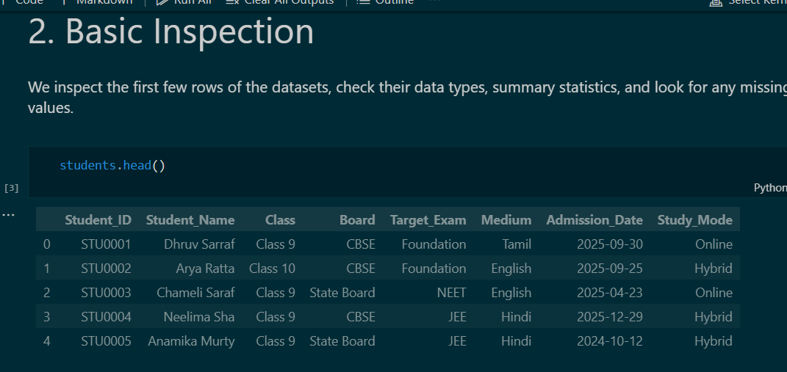
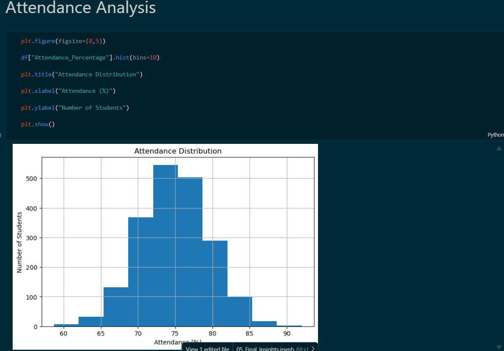
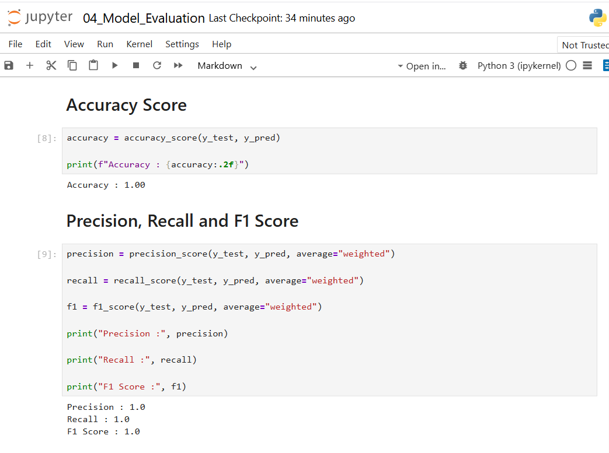
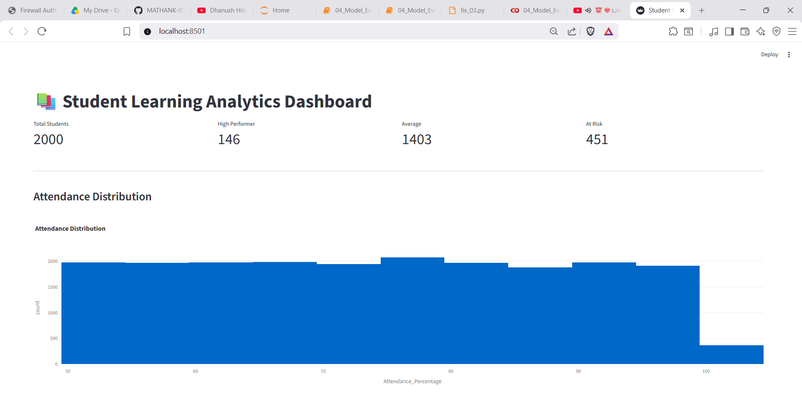

# 🎓 HAWC Evalytix – Student Learning Analytics Challenge

> AI & Data Science Internship Challenge Submission


---

# 📖 Project Overview

This project was developed as part of the **HAWC Evalytix – Student Learning Analytics Challenge**.

The objective is to build an **AI-powered Student Learning Analytics System** capable of generating realistic educational datasets, analyzing student learning behaviour, identifying students who require academic intervention, predicting student performance using Machine Learning, and providing personalized learning recommendations through an interactive Streamlit dashboard.

Since no real educational dataset was available, realistic synthetic datasets were generated to simulate the learning activities of students preparing for competitive examinations such as **JEE, NEET, CBSE, ICSE, and Foundation**.

---

# 🎯 Objectives

The project focuses on the following objectives:

- Generate realistic synthetic educational datasets
- Perform data cleaning and preprocessing
- Conduct Exploratory Data Analysis (EDA)
- Identify learning gaps among students
- Build a Machine Learning prediction model
- Evaluate model performance
- Develop an interactive Streamlit dashboard
- Generate personalized learning recommendations

---

# 🚀 Features

### 📂 Synthetic Dataset Generation

- Generated data for 2000+ students
- Multiple educational datasets
- Realistic relationships between variables

Datasets include:

- students.csv
- attendance.csv
- assignments.csv
- engagement.csv
- quiz_attempts.csv
- mock_tests.csv
- video_logs.csv

---

### 📊 Exploratory Data Analysis

The project performs detailed data analysis including:

- Student statistics
- Attendance analysis
- Assignment performance
- Quiz analysis
- Engagement analysis
- Correlation analysis
- Distribution analysis

---

### 🤖 Machine Learning

Implemented a supervised Machine Learning model to classify student performance.

Tasks include:

- Feature Engineering
- Train/Test Split
- Model Training
- Prediction
- Model Evaluation

Evaluation metrics:

- Accuracy
- Precision
- Recall
- F1 Score
- Confusion Matrix
- Classification Report

---

### ⚠ Learning Gap Analysis

The project identifies students requiring additional academic support based on:

- Attendance
- Assignment scores
- Quiz performance
- Mock tests
- Student engagement

---

### 💡 Recommendation Engine

Personalized recommendations are generated based on student performance.

Examples:

- Improve lecture attendance
- Complete pending assignments
- Increase study hours
- Practice chapter quizzes
- Revise weak subjects

---

### 📈 Interactive Dashboard

Developed using Streamlit.

Dashboard features include:

- Home
- Dataset Overview
- Learning Analytics
- Student Performance Prediction
- At-Risk Students
- Recommendations
- About Project

---

# 🛠 Technology Stack

## Programming Language

- Python

## Development Environment

- Jupyter Notebook
- VS Code

## Libraries

- Pandas
- NumPy
- Matplotlib
- Scikit-Learn
- Joblib
- Streamlit

---

# 📂 Project Structure

```
Student-Learning-Analytics
│
├── dashboard/
│   ├── app.py
│   └── requirements.txt
│
├── data/
│   ├── raw/
│   ├── processed/
│   ├── students.csv
│   ├── attendance.csv
│   ├── assignments.csv
│   ├── engagement.csv
│   ├── mock_tests.csv
│   ├── quiz_attempts.csv
│   └── video_logs.csv
│
├── docs/
│   ├── 01_Project_Overview.md
│   ├── 02_Installation_Guide.md
│   ├── 03_System_Architecture.md
│   ├── 04_Dataset_Documentation.md
│   ├── 05_Data_Preprocessing.md
│   ├── 06_Exploratory_Data_Analysis.md
│   ├── 07_Learning_Gap_Analysis.md
│   ├── 08_Model_Documentation.md
│   ├── 09_Recommendation_Engine.md
│   ├── 10_Dashboard_Guide.md
│   ├── 11_User_Guide.md
│   ├── 12_Developer_Guide.md
│   ├── 13_Project_Report.md
│
├── images/
│
├── models/
│   └── student_model.pkl
│
├── notebooks/
│   ├── 01_Data_Generation.ipynb
│   ├── 02_EDA.ipynb
│   ├── 03_Model.ipynb
│   ├── 04_Model_Evaluation.ipynb
│   └── 05_Final_Insights.ipynb
│
├── README.md
├── requirements.txt
├── LICENSE
└── .gitignore
```

---

# ⚙ Workflow

```
Synthetic Dataset Generation
            │
            ▼
Data Cleaning & Preprocessing
            │
            ▼
Exploratory Data Analysis
            │
            ▼
Learning Gap Analysis
            │
            ▼
Machine Learning Model
            │
            ▼
Model Evaluation
            │
            ▼
Recommendation Engine
            │
            ▼
Interactive Streamlit Dashboard
```

---

# 📸 Project Screenshots

## Dataset Preview



---

## Attendance Distribution



---

## Correlation Heatmap


---

## Model Evaluation



---

## Dashboard



---

# 📈 Machine Learning Workflow

1. Load processed dataset

2. Data preprocessing

3. Feature selection

4. Train-Test split

5. Model training

6. Prediction

7. Model evaluation

8. Save trained model

9. Deploy in Streamlit dashboard

---

# 📊 Results

The developed system successfully:

- Generated realistic educational datasets
- Identified learning behaviour patterns
- Detected students requiring intervention
- Predicted student performance
- Produced meaningful educational insights
- Provided personalized recommendations
- Displayed results through an interactive dashboard

---

# 🎯 Future Enhancements

Future improvements may include:

- Integration with a real Learning Management System (LMS)
- Real-time student performance monitoring
- Deep Learning-based prediction models
- Automated email notifications
- Personalized study plans
- Cloud deployment
- Faculty analytics dashboard

---

# 📚 Documentation

Detailed documentation is available in the **docs/** folder.

- Installation Guide
- User Guide
- Developer Guide
- API Documentation
- Project Report
- Demo Video Script

---

# ▶ Running the Project

## 1 Clone the Repository

```bash
git clone https://github.com/YOUR_USERNAME/HAWC-Evalytix-Student-Learning-Analytics-Challenge.git
```

---

## 2 Navigate to Project Folder

```bash
cd HAWC-Evalytix-Student-Learning-Analytics-Challenge
```

---

## 3 Install Dependencies

```bash
pip install -r requirements.txt
```

---

## 4 Launch Jupyter Notebook

```bash
jupyter notebook
```

Run the notebooks in order:

- 01_Data_Generation.ipynb
- 02_EDA.ipynb
- 03_Model.ipynb
- 04_Model_Evaluation.ipynb
- 05_Final_Insights.ipynb

---

## 5 Launch Streamlit Dashboard

```bash
cd dashboard
streamlit run app.py
```

---

# 👨‍💻 Author

**Mathankumar**

B.Tech – Artificial Intelligence and Data Science

Kongu Engineering College

---

# 📄 License

This project is licensed under the MIT License.

---


This project was developed as part of the **HAWC Evalytix – Student Learning Analytics Challenge** for the **AI & Data Science Internship**.

Special thanks to HAWC Evalytix for providing the challenge statement and learning opportunity.
